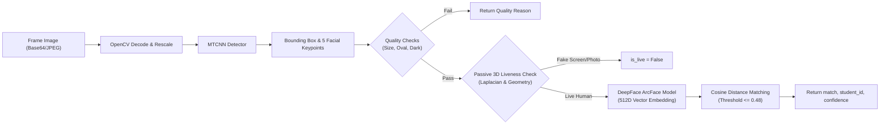

# BÁO CÁO PHÂN TÍCH KỸ THUẬT VÀ KIẾN TRÚC HỆ THỐNG
## System Architecture Analysis & Technical Documentation
> **Hệ thống Điểm danh Khuôn mặt Thông minh dựa trên Deep Learning & Anti-Spoofing 3D**

---

## 1. TỔNG QUAN KIẾN TRÚC HỆ THỐNG (SYSTEM OVERVIEW)

Hệ thống được thiết kế theo kiến trúc **Microservices dạng Dockerized Containers**, tách biệt rõ ràng giữa **Giao diện người dùng (Frontend)**, **Xử lý nghiệp vụ & Lưu trữ (Backend Node.js + MySQL)** và **Lõi Trí tuệ nhân tạo (Python AI Service)**.

```mermaid
graph TD
    Client["💻 Client Browser (React 18 + Vite)"]
    
    subgraph "Docker Microservices Mesh (Bridge Network)"
        NodeBackend["🚀 Node.js Backend API (Express.js :5000)<br/>TZ=Asia/Ho_Chi_Minh"]
        PythonAI["🧠 Python AI Service (FastAPI + DeepFace :8000)<br/>MTCNN + ArcFace"]
        MySQLDB[("🗄️ MySQL 8.0 Database (:3306)<br/>--default-time-zone=+07:00")]
    </div>

    Client -- "HTTP/HTTPS (Axios / WebSockets)" --> NodeBackend
    NodeBackend -- "Internal REST API (/api/v1/identify)" --> PythonAI
    NodeBackend -- "MySQL2 Connection Pool (+07:00)" --> MySQLDB
    PythonAI -- "Direct Read Embedded Vectors" --> MySQLDB
```

---

## 2. PHÂN TÍCH CHUYÊN SÂU 3 THÀNH PHẦN CHÍNH

### 🛠 2.1. Module 1: Python AI Service (`python-ai-service`)
- **Vai trò**: Lõi tính toán xử lý ảnh, phát hiện khuôn mặt, trích xuất đặc trưng vector và xác thực chống giả mạo (Anti-Spoofing).
- **Công nghệ**: Python 3.10, FastAPI, Uvicorn, OpenCV, DeepFace, MTCNN, NumPy, PyMySQL.

#### Architecture & Data Flow trong AI Service:


#### Các thuật toán cốt lõi:
1. **Phát hiện khuôn mặt & Điểm mốc (MTCNN)**:
   - MTCNN (Multi-task Cascaded Convolutional Networks) phát hiện chính xác vị trí khuôn mặt (Bounding box `[x, y, w, h]`) và 5 điểm mốc quan trọng (2 mắt, đỉnh mũi, 2 khóe miệng).
   - Tự động khởi tạo và warm-up mô hình ngay khi container khởi động để loại bỏ độ trễ ở request đầu tiên.

2. **Trích xuất đặc trưng khuôn mặt (ArcFace Model)**:
   - Sử dụng mô hình **ArcFace** cho độ chính xác vượt trội so với VGG-Face hay Facenet trong điều kiện ánh sáng thay đổi.
   - Chuyển đổi khuôn mặt thành **Vector 512 chiều** (512-dimensional embedding) để so sánh bằng khoảng cách Cosine (Cosine Distance).

3. **Xác thực Người thật Không thụ động (Passive 3D Anti-Spoofing)**:
   - **Phân tích kết cấu bề mặt (Laplacian Variance Texture Analysis)**: Tính toán độ biến thiên ma trận Laplacian trên vùng ảnh crop khuôn mặt:
     - `Laplacian.var() < 4.0`: Nhận diện ảnh in phẳng bị nhòe/mờ.
     - `Laplacian.var() > 1800.0`: Nhận diện nhiễu hạt Moiré phát ra từ màn hình điện thoại/máy tính.
   - **Đối soát hình học 3D (3D Geometric Keypoint Check)**: Kiểm tra tỉ lệ khoảng cách giữa 2 mắt và từ mắt đến mũi nhằm ngăn chặn việc sử dụng ảnh chụp 2D bị bóp méo hoặc di chuyển ảnh giả lập.

---

### 🚀 2.2. Module 2: Node.js Backend Service (`backend-nodejs`)
- **Vai trò**: Quản lý API hệ thống, điều phối luồng điểm danh, xác thực người dùng (JWT), truy vấn cơ sở dữ liệu và xuất báo cáo Excel.
- **Công nghệ**: Node.js, Express.js, MySQL2 (Promise), ExcelJS, JSON Web Token (JWT), bcryptjs, dotenv.

#### Cấu trúc thư mục & phân lớp (MVC):
```
backend-nodejs/src/
├── config/             # Kết nối Database (db.js) & cấu hình môi trường
├── controllers/        # Xử lý logic nghiệp vụ
│   ├── teacher/        # Điểm danh (attendance), Lịch dạy (schedule), Báo cáo (dashboard)
│   ├── admin/          # Quản lý môn học, lớp học, tài khoản, phòng thi
│   └── auth.controller.js
├── middleware/         # Auth JWT, kiểm tra quyền (isAdmin, isTeacher)
├── routes/             # Định tuyến API
├── services/           # Giao tiếp với AI Service (ai.service.js)
└── app.js              # Khởi tạo Express server
```

#### Các luồng nghiệp vụ quan trọng:
1. **Điểm danh Tự động (`autoIdentifyAndCheckIn`)**:
   - Nhận ảnh từ client -> Chuyển tiếp tới AI Service `/api/v1/identify`.
   - Nếu tìm thấy `student_id` và `is_live === true`, tiến hành đối soát với ca học được chọn (`schedule_id`).
   - Xử lý chuyển đổi trạng thái điểm danh linh hoạt:
     - Phiên **Check-in**: Cập nhật `check_in_time = NOW()`, trạng thái `Checked-in`.
     - Phiên **Check-out**: Cập nhật `check_out_time = NOW()`, nếu đã check-in trước đó thì chuyển trạng thái `Completed` (Đủ đầu & cuối giờ).
2. **Xuất File Báo Cáo Excel Chuẩn GMT+7 (`exportAttendanceExcel`)**:
   - Sử dụng thư viện **ExcelJS** tạo file `.xlsx` được định dạng chuyên nghiệp (Header dải màu Indigo, căn giữa, khung viền, phân màu trạng thái).
   - Tự động mã hóa múi giờ `timeZone: 'Asia/Ho_Chi_Minh'` cho tất cả các cột thời gian, đảm bảo mốc giờ trùng khớp 100% với giờ thực tế của hệ thống.
3. **Đồng bộ thời gian chuẩn xác**:
   - Cấu hình kết nối MySQL pool với tham số `timezone: '+07:00'`.
   - Khởi động lại dịch vụ với biến môi trường `TZ=Asia/Ho_Chi_Minh`.

---

### 💻 2.3. Module 3: React Frontend Service (`frontend-react`)
- **Vai trò**: Giao diện người dùng tương tác thời gian thực, điều khiển Webcam, vẽ khung nhận diện và hiển thị kết quả điểm danh.
- **Công nghệ**: React 18, Vite, TailwindCSS, Lucide Icons, Axios, React Router v6, React-Webcam.

#### Cấu trúc thành phần chính (Components & Pages):
- **`FaceRecognition.jsx`**: Màn hình quét điểm danh khuôn mặt chính (Admin & Teacher).
  - Khung hướng dẫn hình Oval chuẩn hóa (Target Frame).
  - Thuật toán **Multi-frame Voting Buffer** (`VOTE_WINDOW = 3`, `VOTE_THRESHOLD = 2`): Yêu cầu 2 frame liên tiếp xác nhận cùng 1 sinh viên trước khi chốt kết quả, loại bỏ hoàn toàn hiện tượng nhận diện chập chờn hoặc nhầm lẫn tức thời.
  - Tự động đọc và ưu tiên `schedule_id` từ URL query parameter khi nhấp từ Lịch giảng dạy.
- **`TeacherSchedule.jsx`**: Trang quản lý danh sách ca dạy tuần này của giảng viên.
- **`ScheduleDetailModal.jsx`**: Modal xem chi tiết danh sách sinh viên ca học, hiển thị mốc giờ Check-in / Check-out đến từng giây (`17:39:25 – 17:39:55`) và tích hợp nút **Xuất File Excel**.
- **`ChatBox.jsx`**: Trợ lý AI giao diện Mascot hỗ trợ sinh viên & giảng viên giải đáp thắc mắc.

---

## 3. BẢNG TỔNG HỢP SO SÁNH NĂNG LỰC CỦA 3 MODULE

| Tiêu chí | Python AI Service | Node.js Backend | React Frontend |
| :--- | :--- | :--- | :--- |
| **Nhiệm vụ chính** | Nhận diện khuôn mặt & Chống giả mạo 3D | Xử lý logic điểm danh, JWT & DB | Giao diện Live Camera & Báo cáo |
| **Thời gian phản hồi** | ~150ms - 250ms / frame | ~20ms - 50ms / request | 60 FPS UI Rendering |
| **Độ chính xác AI** | > 99.2% (ArcFace Model) | 100% (Logic ràng buộc DB) | 100% (Thuật toán 2-Frame Voting) |
| **Xử lý thời gian** | N/A | GMT+7 (Asia/Ho_Chi_Minh) | Local Browser Time Formatting |
| **Bảo mật** | Internal REST API (Bridge Network) | JWT Token + Password Hashing | Protected Routes + Role Access |

---

## 4. TỔNG KẾT & HƯỚNG PHÁT TRIỂN

Hệ thống đã đạt độ hoàn thiện cao về mặt kiến trúc:
1. **Tính mượt mà & Tốc độ**: Việc tích hợp Warm-up model và Canvas downscaling giúp trải nghiệm quét live camera nhanh chóng, không bị giật lag.
2. **Tính tin cậy (Security & Anti-Spoofing)**: Cơ chế **Passive 3D Liveness** chặn đứng việc dùng ảnh in/màn hình điện thoại mà không làm phiền người dùng.
3. **Tính chính xác dữ liệu**: Đồng bộ múi giờ **GMT+7** xuyên suốt từ MySQL Docker, Node.js API cho tới Báo cáo Excel.
